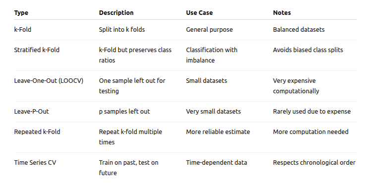

## Cross-validation

- Cross-validation is a technique used in machine learning and statistics to evaluate how well a model generalizes to an independent dataset — basically, how well it performs on new, unseen data.

#### How it works:

- You split your dataset into multiple parts (called folds).

- You train the model on some folds and test it on the remaining fold.

- You repeat this process several times, each time using a different fold as the test set.

- Then, you average the performance results to get a more reliable estimate of the model’s accuracy.

#### Why is it useful?

- It helps avoid overfitting (when a model performs well on training data but poorly on new data).

- It provides a more robust measure of model performance than just a single train-test split

- Useful when you have limited data.

### It's types

#### k-Fold Cross-Validation

- The most common type.
- The dataset is split into k equal parts or folds.
- The model is trained on k-1 folds and tested on the remaining fold.
- This process is repeated k times, each time with a different fold as the test set.
- The final performance is the average of all k test results.

#### Stratified k-Fold Cross-Validation

- A variation of k-fold.
- Ensures that each fold has approximately the same percentage of samples of each target class as the full dataset.
- Useful especially in classification tasks when classes are imbalanced.
- Prevents the test or training sets from being biased toward one class.

#### Leave-One-Out Cross-Validation (LOOCV)

- Extreme case of k-fold where k = number of data points.
- Train the model on all data points except one, then test on that single point.
- Repeat this for every data point.
- Very computationally expensive but uses almost all data for training each time.
- Good for very small datasets.

#### Leave-P-Out Cross-Validation

- Similar to LOOCV, but instead of leaving one data point out, you leave p data points out for testing.
- Train on the remaining data
- Repeat for all possible combinations.
- Also computationally expensive and rarely used for large datasets.

#### Repeated k-Fold Cross-Validation

- Repeats the k-fold cross-validation process multiple times with different random splits.
- Helps reduce variability ( one split might give 95% accuracy, another might give 85%, even though it’s the same model ) in the performance estimate.
- For example, 5-fold repeated 10 times means the whole 5-fold process runs 10 times with different splits.

#### Time Series Cross-Validation (Rolling or Forward Chaining)

- Used for time-dependent data where order matters.
- Instead of random splits, it respects the time order.
- Train on earlier time points, test on later time points.
- For example, train on data from time 1 to t, test on time t+1, then roll forward.

### Summary

