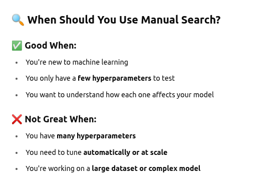
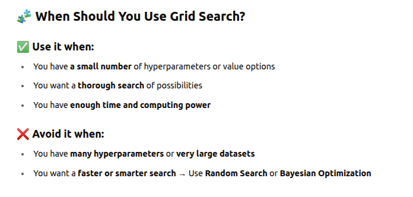
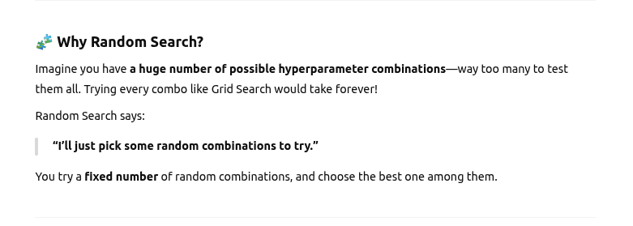
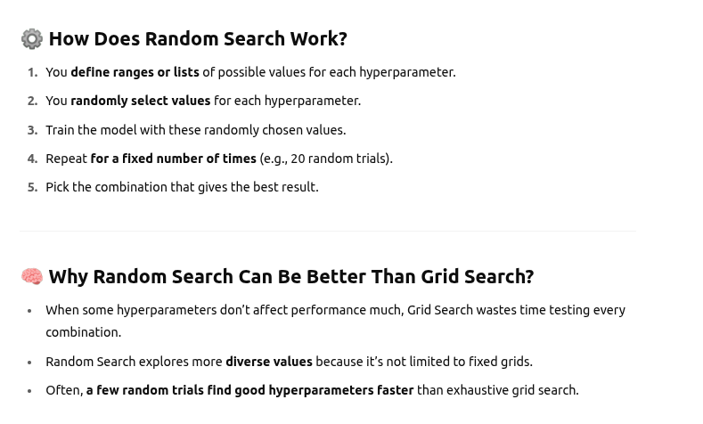
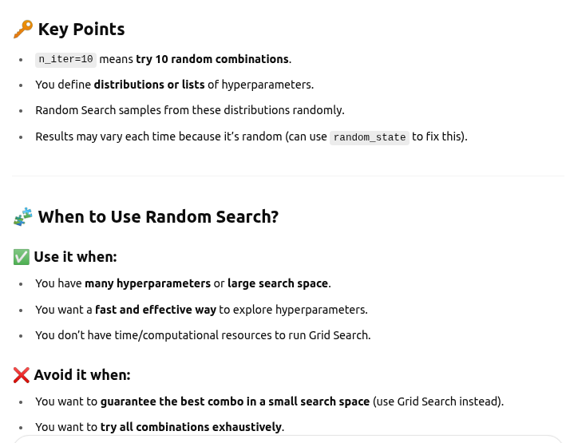
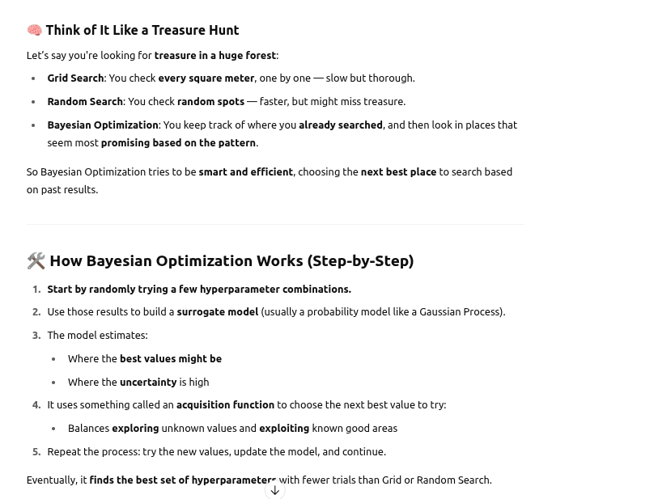
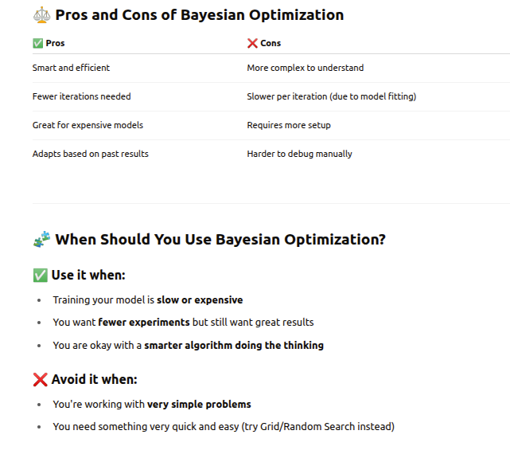
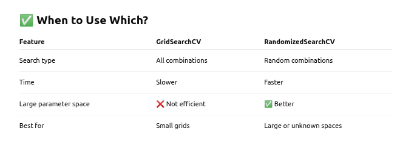

## Hyperparameter tuning

- Hyperparameter tuning is the process of finding the best settings (called hyperparameters) for a machine learning model to perform optimally.

- Choosing good hyperparameters can drastically improve your model’s accuracy and ability to generalize to new data.

#### How does Hyperparameter Tuning work?

- You try different combinations of hyperparameters, train your model on training data, and evaluate its performance (usually using cross-validation)

- Then you pick the combination that gives the best result.

### Methods of hyperparameter tuning

##### Manual Search (Trial and Error)

- You choose values based on your experience or intuition.

- Simple, but not efficient for complex models.

- Example: Try learning rates of 0.1, 0.01, and 0.001, and see which one works best.

##### Grid Search

- Here you define a list of possible values for each hyperparameter.

- The method tries every combination of those values.

- Then it picks the combination that gives the best model performance (e.g., highest accuracy or lowest error).

- It’s called a “grid” because it forms a grid of combinations, like a table.

- It is very slow when you have many parameters and Computationally expensive for large grids.

##### Random Search

- Instead of trying every possible combination of hyperparameters (like Grid Search).

- Random Search tries random combinations of hyperparameters from the space you define.

###### Why Random Search?

###### How Does Random Search Work?

###### Key Points

##### Bayesian Optimization

- It doesn’t try all combinations (like Grid Search), or random ones (like Random Search).

- Instead, it learns from past results and uses probability to guess what hyperparameters might work best next.

- It says: I’ve already tested these values. Based on the results, I’ll try new values that are most likely to improve performance.

###### How Bayesian Optimization Works ?

##### Genetic Algorithms / Evolutionary Search

-

###### What is GridSearchCV or RandomizedSearchCV ?

- They are automated tools that help you find the best hyperparameters for your machine learning model

