# LightGBM ( Light Gradient Boosting Machine )

- It is a popular open-source gradient boosting framework developed by Microsoft.

## Key Features of LightGBM

- **Speed and Efficiency**: LightGBM is optimized to train much faster than many other boosting algorithms like XGBoost.

- **Lower Memory Usage**: It uses a histogram-based algorithm, which reduces memory consumption.

- **Better Accuracy**: Supports advanced features like leaf-wise tree growth, which can lead to better accuracy compared to level-wise growth in some datasets.

- **Handles Large Datasets**: Works well with large datasets and supports parallel and GPU learning.

- **Supports Categorical Features**: Can handle categorical features directly without needing to convert them to one-hot encoding.

- **Flexible**: Can be used for classification, regression, ranking, and many other machine learning tasks.

## How LightGBM works 

- LightGBM works almost same as XGBoost with some advancement to make it more optimize.

### Building a Tree

### Histogram-Based Decision Trees

##### Why Do We Need Histogram-Based Decision Trees?

- When building a decision tree (like in LightGBM), we need to find the best place to split the data.

- For example: Should I split the data on Age > 30?

- But there might be thousands of possible split points in continuous features like "Age" or "Salary."

- Trying all split points is slow and memory-heavy.

- So instead of checking every possible value, LightGBM says:

- “Let’s group similar values into bins (buckets), and only try split points between bins.”

- This is what the Histogram-Based Decision Tree does.

##### How we create Histogram-Based Decision Trees?

###### Step 1: Binning (Discretization)

- Suppose a feature has continuous values like

- Age: 22, 25, 27, 31, 34, 36, 40, 45, 50, 55

- Let’s say we want to bin them into 4 buckets.

- We can do this by equal-width or equal-frequency (LightGBM often uses quantile-based binning for numeric stability and balance).

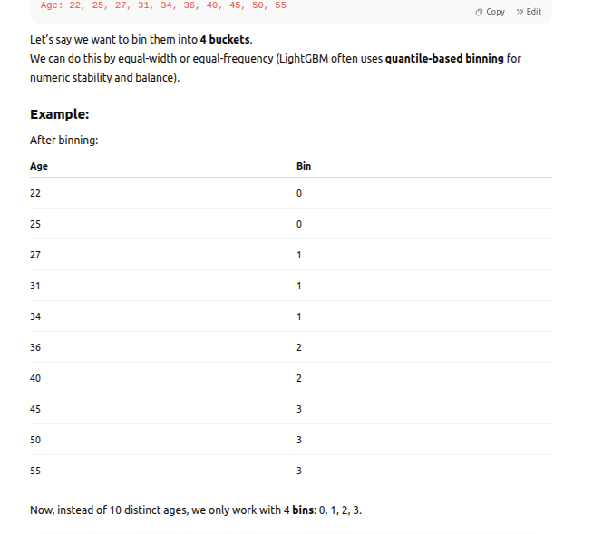

###### Step 2: Building Histograms

- Now that data is binned, we build histograms for each feature.

- Let’s say we're computing the histogram for feature "Age".

###### Step 3: Finding the Best Split

###### Step 4: Actually Splitting

- Once the best bin to split on is found, we:

    1. Assign all data points in the left bins to the left child node

    2. Assign others to the right child

    3. Repeat this process recursively to grow the tree

##### Advantages of Histogram-based Trees

##### Summary

### Leaf-Wise Growth

- Instead of growing trees level by level (like XGBoost), LightGBM grows the leaf with the highest loss reduction first.

- This leads to:

    1. Deeper trees
    2. Better accuracy
    3. But also possible overfitting (controlled via parameters like max_depth)

##### What Is Tree Growth Strategy?

- In decision tree algorithms, the way we grow the tree (i.e., decide which node to split next) can be done in different ways.

- There are two main strategies:

1. **Level-wise Growth (used by XGBoost)**

- The tree grows level by level, splitting all leaves at the same depth.

- Balanced trees

- Slower, often wastes effort splitting less useful leaves.

2. **2. Leaf-wise Growth (used by LightGBM)**

- Always splits the leaf with the maximum loss reduction (highest gain).

- Tree grows deep in places where it's most helpful.

- Often results in fewer splits, faster learning, and better accuracy.

### Gradient-based One-Side Sampling (GOSS) 

- Gradient-based One-Side Sampling (GOSS) is a method used in LightGBM to speed up training by reducing the amount of data used in each boosting iteration, without losing accuracy

##### Why do we need sampling?

- Training gradient boosting trees can be slow on very large datasets.

- If we just randomly sample data points (like regular random sampling), we may lose important information, especially from data points where the model is making big errors.

- GOSS solves this by selecting data points based on their gradients, which tell us how “hard” each point is to predict.

#### GOSS intuition

- GOSS keeps all the “hard” examples (with large gradients) because they carry more useful information for learning.

- It randomly samples from the “easy” examples (small gradients), because they’re less important and can be reduced without much harm.

#### How does GOSS work mathematically?

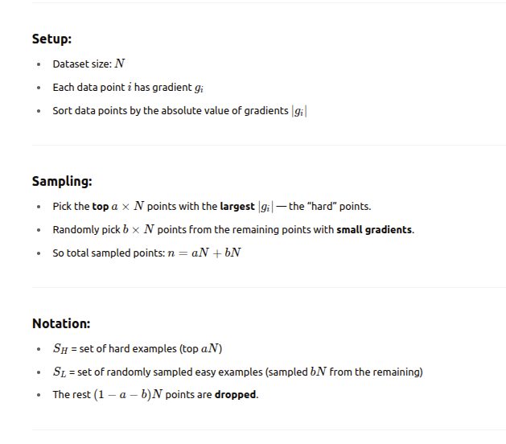

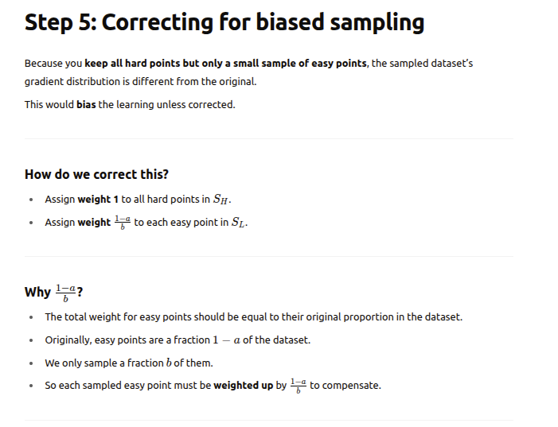

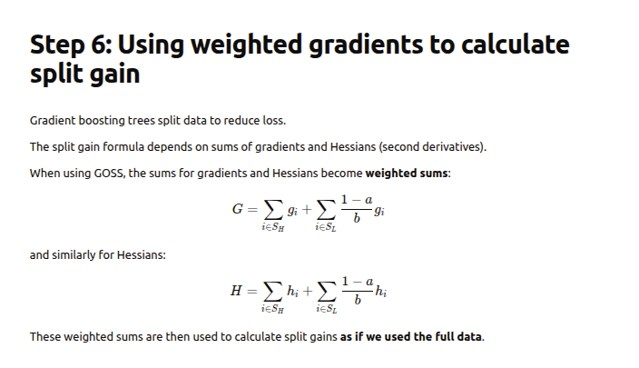

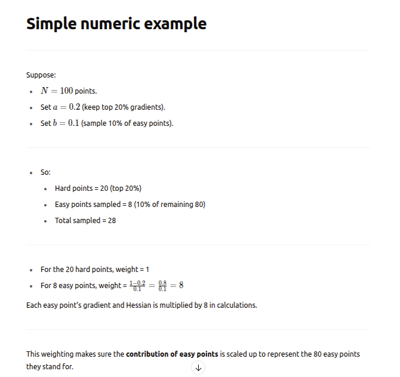

#### How GOSS preserves accuracy

- We keep all hard examples which have big gradients and carry important information

- We keep a weighted sample of easy examples to maintain overall gradient distribution.

- This gives an unbiased estimate of the full gradient and Hessian sums.

- So the model trained on this smaller weighted sample behaves similarly to one trained on the full data

### Exclusive Feature Bundling

- EFB is a trick LightGBM uses to reduce the number of features (columns) in your dataset without losing information.

- which, Speeds up training, Saves memory, And keeps the accuracy almost the same.

- It does this by bundling mutually exclusive features (features that are non-zero at different times) into one single feature.

#### Why do we need EFB

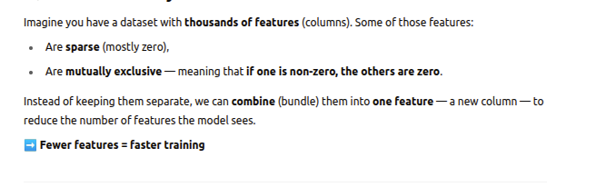

#### How does GOSS work mathematically?

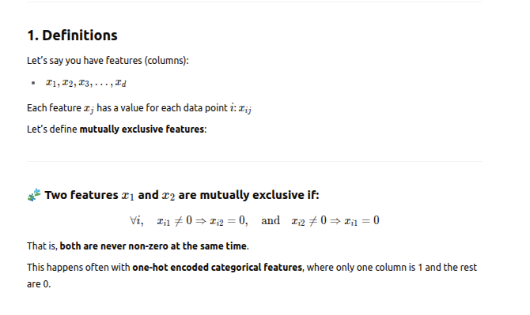

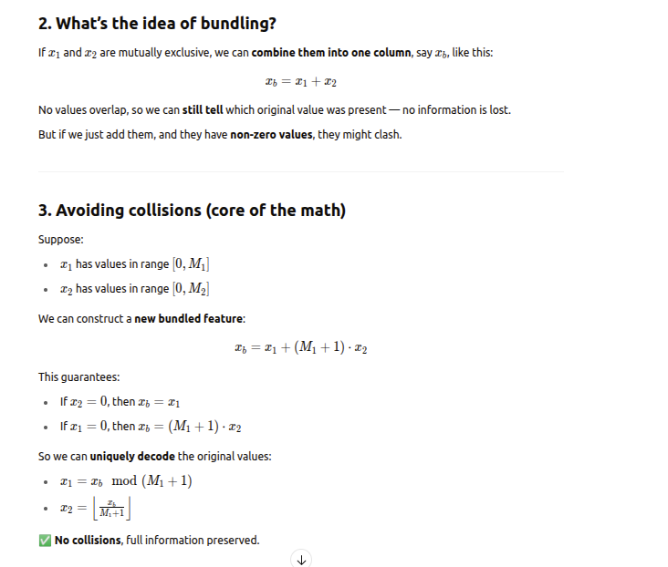

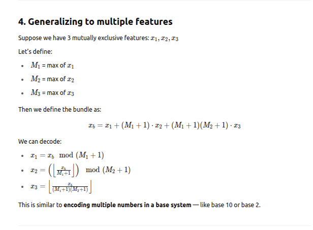

#### How we are decoding here?

- Decoding with Mod and Floor is Like Extracting Digits in Base Systems.

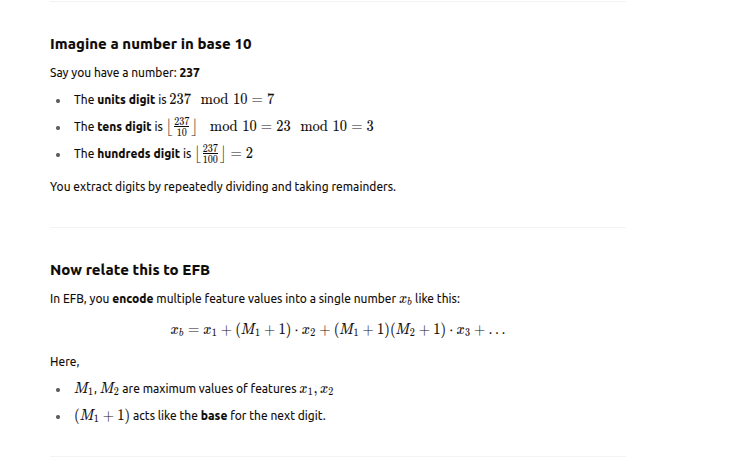

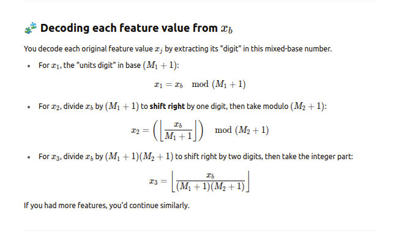

###### Concrete example to see this clearly

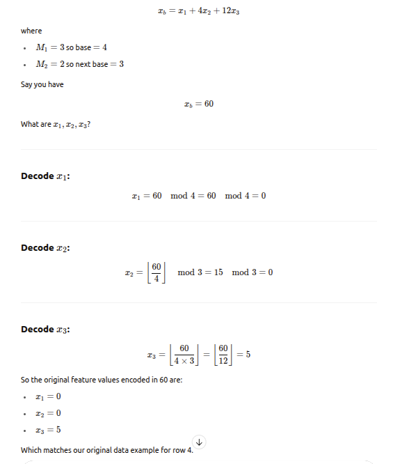

#### How do we decide which features to bundle?

- LightGBM does this using a greedy graph coloring algorithm.

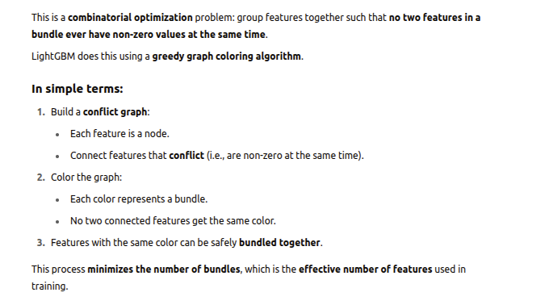

#### What is Greedy Graph Coloring algo and how does it work?

-

#### Example of EFB

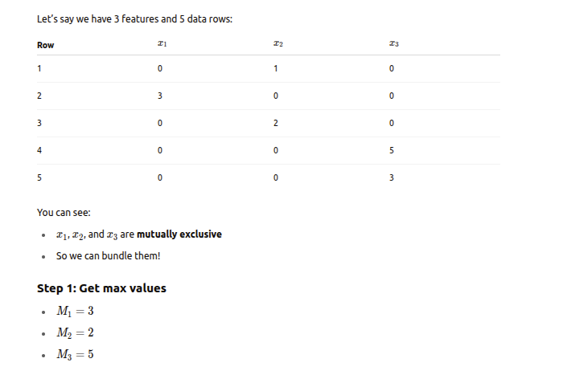

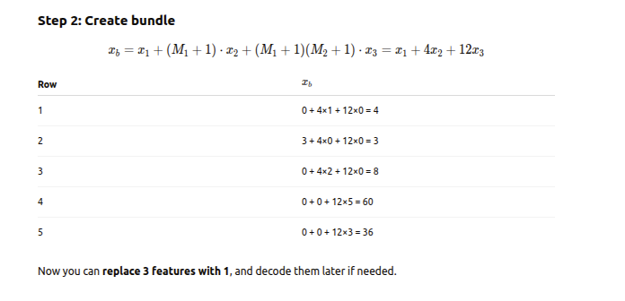

### Regularization

## Summary

## Usecase

####################

Strategy of leaf wise tree growth = https://prnt.sc/dMKKZCVklLm4

- https://prnt.sc/S5VwzmgrYSdl
####################

*What is gradient*

- Gradient: Comes from calculus. It's a way to figure out how to change something to make it better (like minimizing error). Think of it as a “direction of improvement.”

*Why Taylor Expansion is used*

- To efficiently find the best tree at each step, LightGBM uses gradient boosting, which involves Taylor series expansion.

