# Regression Loss Functions

#### MSE ( Mean Squared Error) / L2 

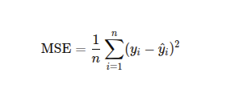

##### When to Use

- When large errors should be heavily penalized.

- In applications where outliers carry important information (e.g., financial forecasting, risk modeling).

- When you want a differentiable and smooth loss function for gradient-based optimization.

##### Pros

- Penalizes large errors more than small ones (useful for emphasizing large mistakes).

- Smooth and differentiable — works well with gradient descent.

- Statistically corresponds to maximizing likelihood under Gaussian noise.

##### Cons

- Sensitive to outliers (a few large errors can dominate the total loss).

- Error units are squared, making interpretation less intuitive

#### MAE ( Mean Absolute Error) / L1

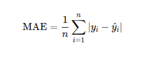

##### When to Use

- When you want a robust metric that treats all errors equally.

- When dealing with data with outliers you want to ignore or minimize the influence of.

- For models where interpretability is important (units of MAE match the original data).

##### Pros

- Robust to outliers, treats all deviations equally.

- Easier to interpret — same units as the target variable.

- Represents the median of the error distribution.

##### Cons

- Not differentiable at 0 (though this is usually handled in practice).

- Optimization can be slower or less stable than MSE with some algorithms ( it might zigzag or take longer to converge).

- May under-penalize large errors if they're critical in your application.

#### Huber Loss

- Huber Loss is a smart loss function that:

    - Acts like MSE (Mean Squared Error) when the error is small
    - Acts like MAE (Mean Absolute Error) when the error is large

- It’s designed to give you the best of both worlds

    - Accuracy when predictions are close to the truth
    - Robustness when there are outliers (extreme errors)

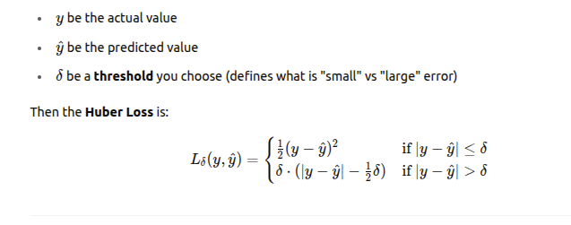

##### Intuition Behind the Huber loss

- When the error is small, we use the squared term like MSE. This helps make precise predictions.

- When the error is big, we switch to linear penalty like MAE — to avoid letting a few large errors ruin the whole loss.

- The switch happens smoothly at the threshold δ.

##### Why Use δ ?

- δ controls how tolerant you are of outliers.

    - Small δ → more like MAE (robust to outliers)
    - Large δ → more like MSE (sensitive to all errors)

- You choose δ based on your data's characteristics (can also be tuned like a hyperparameter).

##### Pros

- **Balances accuracy and robustness** - Small errors are treated with MSE; large errors with MAE.

- **Differentiable everywhere** - Unlike MAE ( not differentiable at 0), Huber is smooth → better for training.

- **Works well with gradient descent** - Makes optimization more stable than MAE.

- **Customizable with δ** - You can fine-tune how sensitive it is to outliers.

##### Cons

- **You must choose δ** - Choosing a bad δ may reduce performance.

- **More complex than MSE/MAE** - Slightly harder to implement or explain.

- **Not fully robust to extreme outliers** - MAE still does a better job ignoring extreme anomalies.

# Classification Loss Functions

## Binary Classification

#### Binary Cross-Entropy (Log Loss)

- It measures the performance of a classification model whose output is a probability value between 0 and 1.

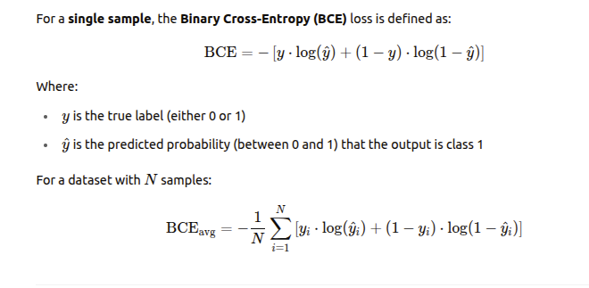

##### Intuition Behind BCE

- BCE penalizes predictions that are far from the actual class:

    - If the true label is 1 and the predicted probability is close to 1, the loss is small.
    - If the true label is 1 and the predicted probability is close to 0, the loss is large (approaches ∞ as y_pred -> 0).
    - Likewise, if the label is 0 and y_pred -> 1, the loss is large.

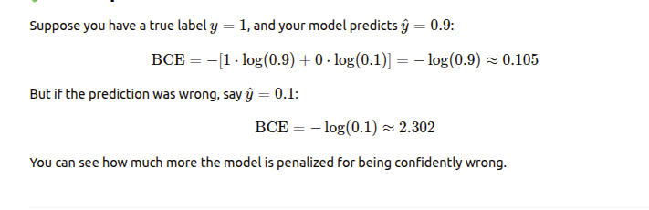

##### When to Use BCE

- Your target variable is binary (e.g., spam vs. not spam).

- Your model outputs a probability (typically using a sigmoid activation at the output layer).

- You need a differentiable loss function for gradient-based optimization (e.g., SGD, Adam).

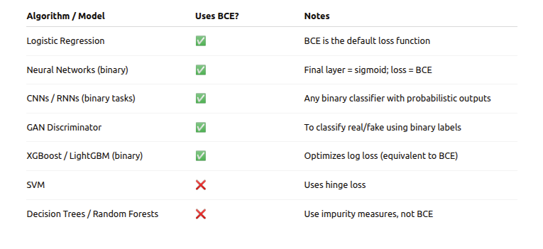

##### Pros

- **Probabilistic Interpretation**: Works well when your model outputs a probability (thanks to the sigmoid).

- **Smooth Gradient**: Enables effective training with gradient descent-based optimizers.

- Penalizes wrong confident predictions heavily

- Well-suited for imbalanced data when used with class weighting or sampling strategies.

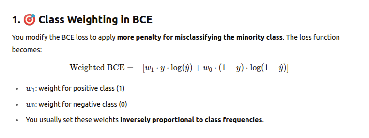

##### Cons

- **Sensitive to Incorrect Confident Predictions**: If a model predicts 0.999 for a class 0 sample, the loss becomes very large.

- **Numerical Stability**: When y_pred = 0 or 1, the log terms go to -> infinity; in practice, you need to clip predictions to avoid NaNs.

- **Can be affected by class imbalance** unless handled explicitly (via resampling or using weighted loss).

- **Assumes Independent Samples**: Assumes each prediction is independent from others, which may not hold in sequence or time-series data.

## Multiclass Classification

#### Categorical Cross-Entropy

- It is an extension of Binary Cross-Entropy (BCE) for problems where there are more than two possible classes.

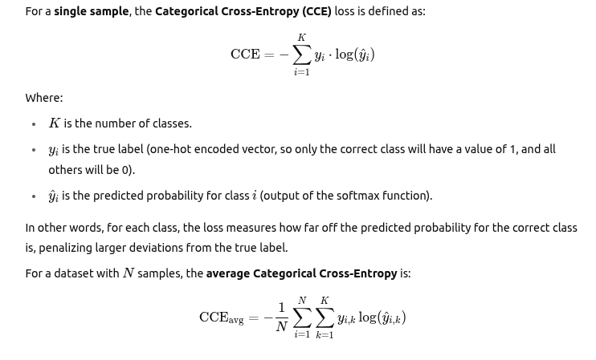

##### Intuition Behind Categorical Cross-Entropy

- The idea is similar to Binary Cross-Entropy, but with the difference that:

    - Softmax is used in multi-class classification to convert raw model outputs (logits) into probabilities.

    - The correct class will have the maximum log-probability and the other classes will contribute 0 to the loss.

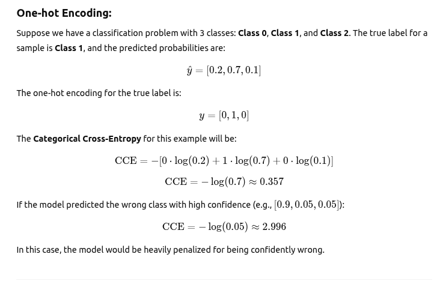

##### When to Use

- You have a multi-class classification problem (more than two classes).

- Your model outputs probabilities (usually via a softmax activation on the final layer).

- The labels are one-hot encoded (each class is represented by a vector, where only the correct class is 1, and others are 0).

##### Pros

- **Handles Multi-Class Problems**

- **Probabilistic Interpretation**: It works with probabilities, so you get meaningful outputs, such as the probability distribution over all classes.

- **Smooth Gradient**: It has a smooth gradient, making it ideal for training with gradient-based optimization methods (like SGD, Adam).

- **Efficient**: Commonly used in deep learning models like neural networks, CNNs, and RNNs, it allows backpropagation to propagate the error signal efficiently.

##### Cons

- **Sensitive to Wrong Confident Predictions**

- **Requires One-Hot Encoding**: Categorical labels must be one-hot encoded, which can be inefficient for problems with a large number of classes.

- **Numerical Instability**: If the predicted probability for a class is very close to 0 or 1, log terms can cause numerical instability. This is usually mitigated with techniques like log-smoothing or by using stable softmax computations.

- **Class Imbalance**: If one class is much more frequent than others, the model might be biased toward predicting that class, unless techniques like class weighting or oversampling/undersampling are applied.

#### Hinge Loss

- Hinge Loss is a loss function primarily used for "maximum-margin" classification, especially with Support Vector Machines (SVMs).

- It's designed to penalize not only misclassified examples but also correctly classified ones that are too close to the decision boundary.

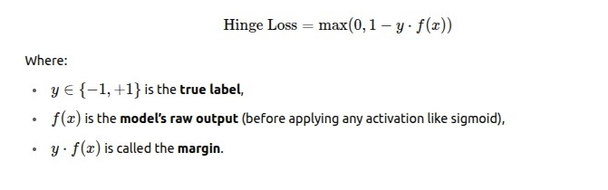

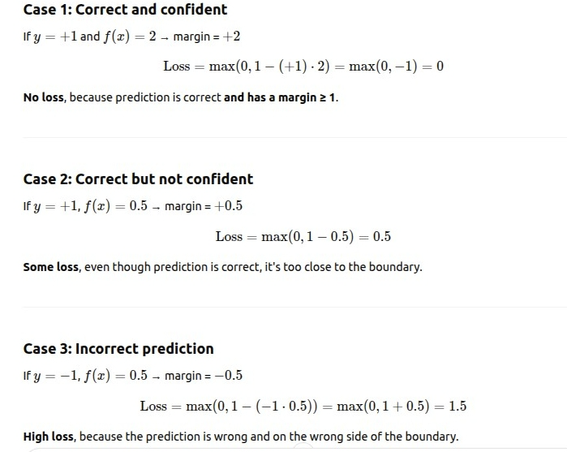

**Hinge loss says**

- Zero loss if correct & confident (margin ≥ 1)

- Small loss if correct but unsure (0 < margin < 1)

- Big loss if wrong (margin < 0)

