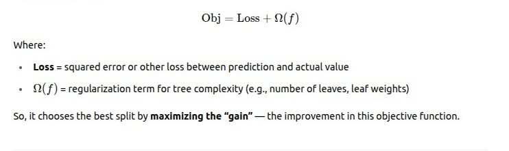

# Boosting Questions

## Gradient Descent

#### How the regression tree is built in Gradient Boosting ?

- This regression tree is built by finding splits on any of the independent features that minimize the squared error (or the loss) of the residuals.

- The selection of the best feature and split at each iteration in Gradient Boosting (or any decision tree) is not random — there’s a systematic way to find it.

- We try all possible splits on all features.

- Evaluate each split by how much it reduces the residual variance (sum of squared residuals).

- Pick the best split.

#### How do we find the best split at each node ?

- At each node of the tree, you want to split the data into two groups based on a feature and a split value so that the sum of squared residuals (or variance) within the groups is minimized.

#### Is we only create Binary trees in gradient Boosting ?

- In theory, you could create splits that partition a node into more than two groups (multi-way splits).

- But in practice, gradient boosting algorithms almost always use binary splits.

- The final tree will have multiple leaves, but they result from a series of binary splits.

#### Why we only create binary trees ?

- **Simplicity**: Binary splits are easier to compute and optimize.

- **Efficiency**: It's easier to evaluate and compare splits when they are binary.

- **Simplicity**: Binary trees allow fine-grained control over tree complexity by limiting depth or number of leaves.

#### How the number of leaves or tree depth affects Gradient Boosting performance ?

- Depth and number of leaves control the complexity of each individual tree.

## XGBoost

### What is XGBoost trying to do ?

- It's an optimized implementation of gradient boosting.

- When building trees, XGBoost doesn’t just look at reducing the residual error — it optimizes a regularized objective function:

- So, it chooses the best split by maximizing the “gain” — the improvement in this objective function.

#### How the XGBoost find the best split feature and split point in regression.

- The gain tells us how much the loss is improved by splitting.

- The first two terms represent the quality of the left and right child nodes.

- The third term is the quality of the parent node (before splitting).

- So gain = (sum of children’s quality) - (parent quality) - (split penalty).

#### What is λ (lambda) in gain formula ?

- L2 regularization term on leaf weights. It shrinks the leaf weights to reduce overfitting and make the model more stable.

###### What is leaf weight ?

- When XGBoost builds a regression tree, each leaf node of the tree represents a predicted value (also called leaf weight).

- This leaf weight is the output value (or score) assigned to all samples that fall into that leaf.

- So the leaf weight corresponds to the prediction adjustment XGBoost makes for samples in that leaf.

###### How are leaf weights calculated?

- XGBoost tries to find the optimal leaf weight w^*that minimizes the objective function (loss + regularization).

#### What is γ (gamma) in gain formula ?

- It is the minimum loss reduction required to make a split.

- It acts as a penalty on splitting, controlling tree complexity (higher γ → fewer splits).

## LightGBM

#### How we decide the number of buckets in Histogram-Based Decision Trees?

- the algorithm works on these buckets to speed up training and reduce memory usage.

- The number of buckets is typically a user-defined hyperparameter.

#### How the XGBoost and LightGBM handle the categorical data?

**LightGBM**

**XGBoost**

