# SVR

- The key idea is to find a function that maps the input variables x to an output y, in a way that errors are within a certain margin.

- The key difference with traditional regression methods (like linear regression) is that we introduce a margin of tolerance, ε, around the true target values yi and the model should only penalize errors that exceed this margin.

#### The Regression Function (Hypothesis)

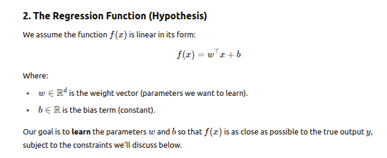

#### Epsilon-Insensitive Loss Function

- In standard regression, the loss function might be something like Mean Squared Error (MSE), where every error contributes to the cost.

- In SVR, we introduce a margin (tolerance) ε, which allows for small deviations without penalizing them.

- The idea is that if the predicted value is within the margin ε of the actual value, there is no penalty.

- The epsilon-insensitive loss function for a single data point is:

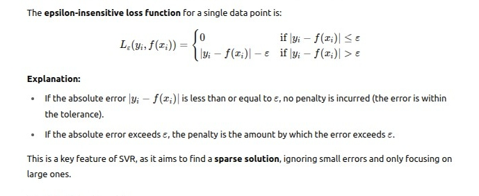

- Now, we want to minimize the total loss for all the training points.

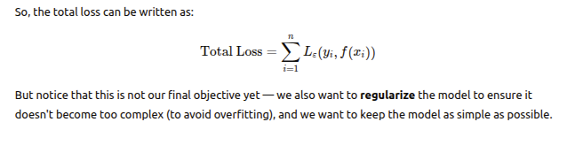

#### Regularization (Model Complexity)

- SVR aims to find the simplest function f(x) = w^T(x) + b (a linear function) that fits the data well. 

- This means we want to avoid very large weights w because large weights can lead to overfitting.

- To achieve this, we add a regularization term that penalizes large weights. 

- The regularization term is typically 1/2(||w||)^2, which is a measure of the magnitude of the weights.

- The smaller the magnitude of w, the simpler the model.

- Now we have two components in the objective:

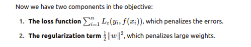

#### Introducing Slack Variables

- One more thing: because we allow some error beyond the margin ε, we need to measure the amount of error for each data point.

- To do this, we introduce slack variables ξi and ξi∗

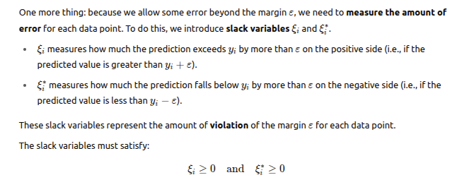

- Now, we can rewrite the loss function for each data point using the slack variables

- If the error exceeds ε, it will be captured by the slack variables ξi and ξi∗
​
- Thus, the loss function becomes

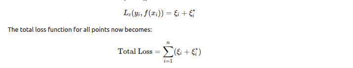

#### Final Objective Function

- Now combine the regularization term with the total loss function

- The final objective function we aim to minimize is:

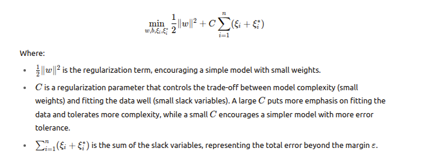

###### Constraints on Slack Variables

- To make sure the slack variables are properly defined, we add the following constraints to the optimization problem.

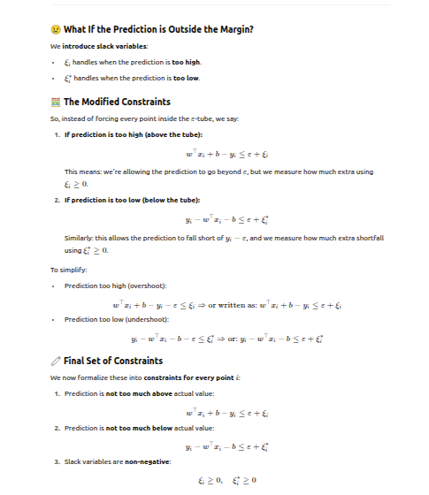

**Q: Why Two Different Forms in the Constraints although the loss is y_true - y_pred ?** 

- The key idea is that constraints are directional, while loss is symmetric.

- We break the absolute error into two separate inequality constraints to handle both overprediction and underprediction separately.

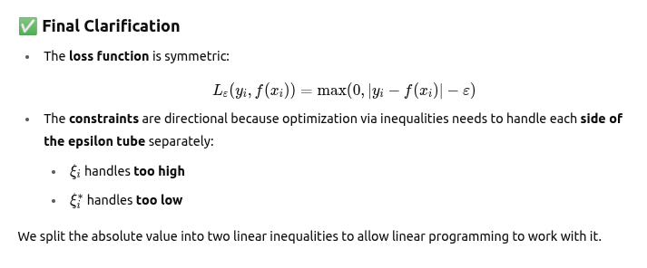

###### Final Optimization Problem

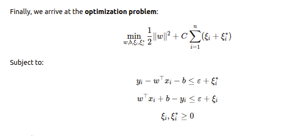

#### Form the Lagrangian (KKT Conditions)

- To derive the dual, we build the Lagrangian function using Lagrange multipliers.

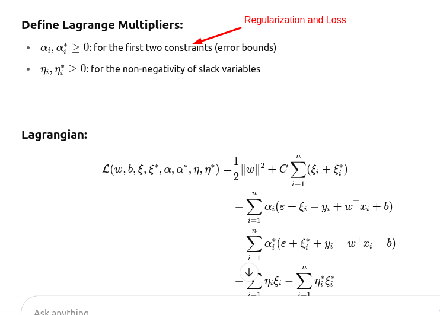

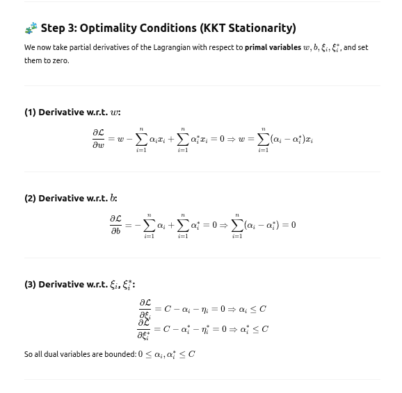

#### Dual Formulation

- Expand all sums of Langrangian equation and group similar terms.

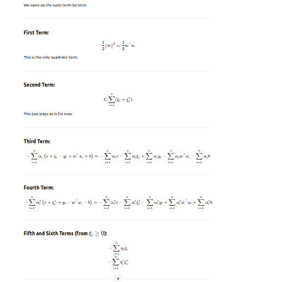

-  Collect All Terms, Let’s rewrite L grouped by variables

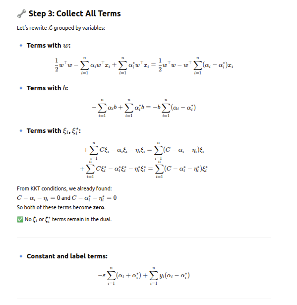

- Final Expression for the Dual Lagrangian

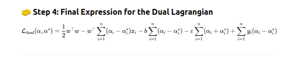

- Substitute Optimal w value in Dual Formulation

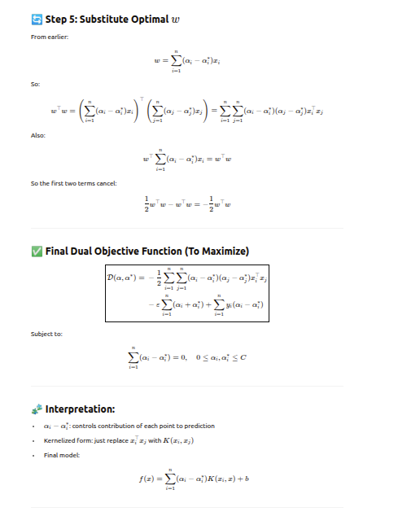

- Now we solve the Dual Optimization Problem and find the value of αi and (αi)^*, which are related to the margins and error constraints.

- We find the αi and (αi)^* for every record

- However only some αi ,αi∗ will be non-zero

- Most of the time:

*For points inside the ε-tube, we get αi = αi∗ = 0*

*Only for points lying outside the tube (support vectors), one of the two will be non-zero*

- So in practice, only a subset of training points affect the final model — these are the support vectors

#### Final Prediction

- Once the optimization problem is solved, the final function f(x) (our regression model) is:

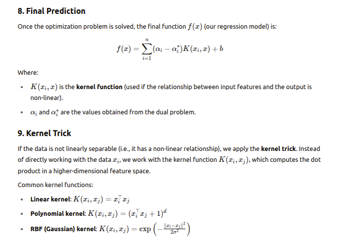

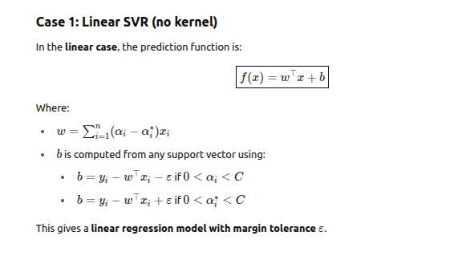

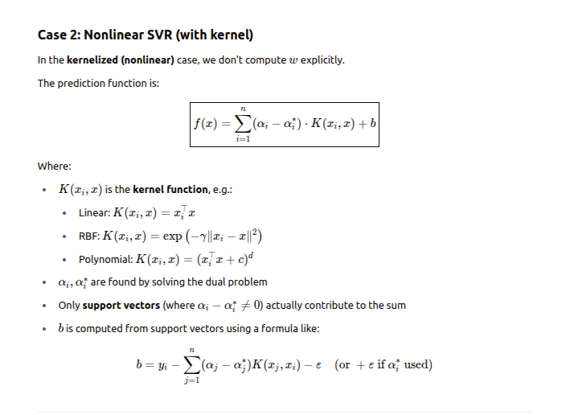
​
##### Weight and Bias formula

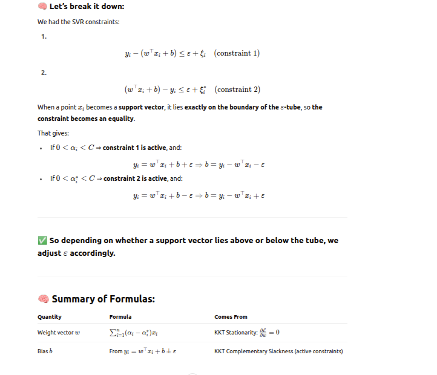

