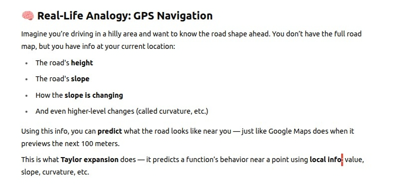
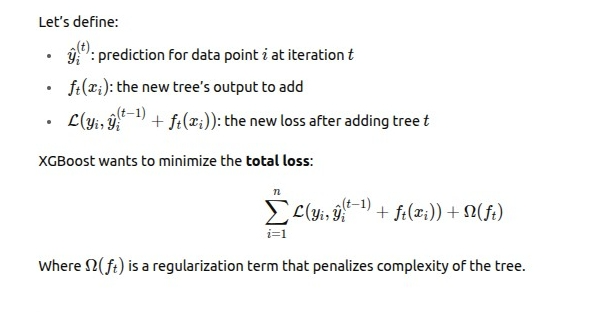
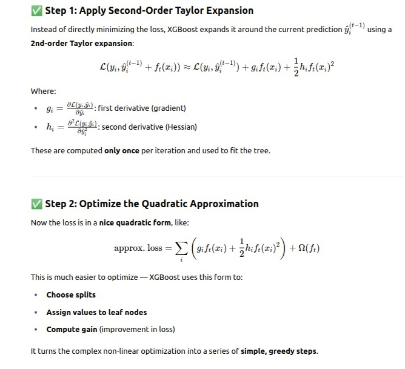

# Taylor Expansion

- Taylor Expansion is a way to approximate a complicated function using polynomials (which are easier to work with).

### Its Math

### Where does Taylor Expansion Come In XGBoost

- In XGBoosting we need to optimize a loss function 𝐿 over predictions.

- However, the loss function can be complicated or non-linear, and we can't directly optimize it over trees.

- XGBoost uses a second-order (2-term) Taylor expansion to approximate the loss function.

- Which helps it build better decision trees more efficiently and accurately.

### Its Math

- Taylor Expansion allow to make a locally smart update without needing to fully solve the global loss.

### Why Use the 2nd-Order Taylor Expansion in XGBoost ?

- XGBoost could use just the gradient (first derivative), like standard gradient boosting. But the second-order term gives:

- Better approximations of the loss

- More stable optimization

- Faster convergence

- Ability to do exact greedy splits and calculate gain more precisely