# XGBoosting 

- XGBoost stands for eXtreme Gradient Boosting.

- It used for supervised learning tasks that builds an ensemble of decision trees sequentially to make powerful predictions.

- XGBoost works in the same way as Gradient Boosting but with some advancement.

- XGBoost tries to minimize a total objective function.

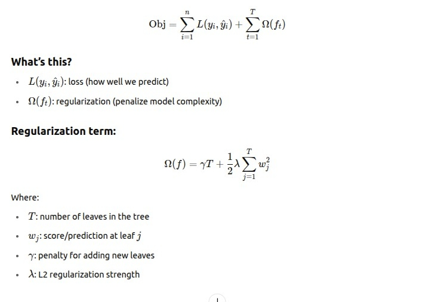

- Now, suppose you start with a guess

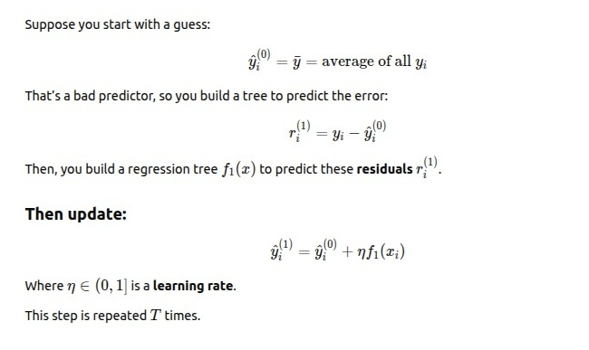

- Now using Gradients to solve

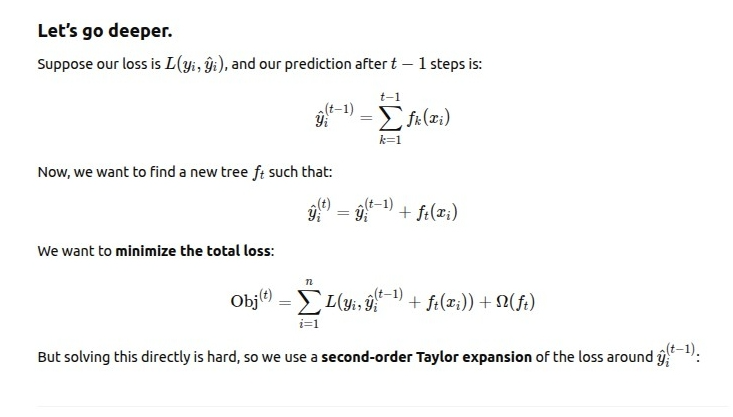

- Now this is our object and we have to build the tree to minimize this objective loss.

- But solving this directly is hard, so we use a second-order Taylor expansion of the loss.

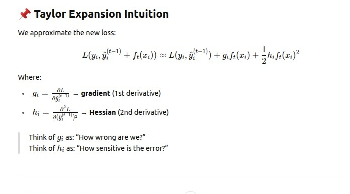

- We now construct the tree f(t) to minimize the objective function.

### 1/n and 1/2 in loss function

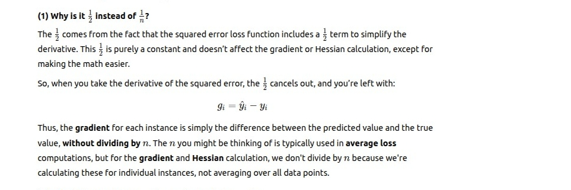

### Loss function difference

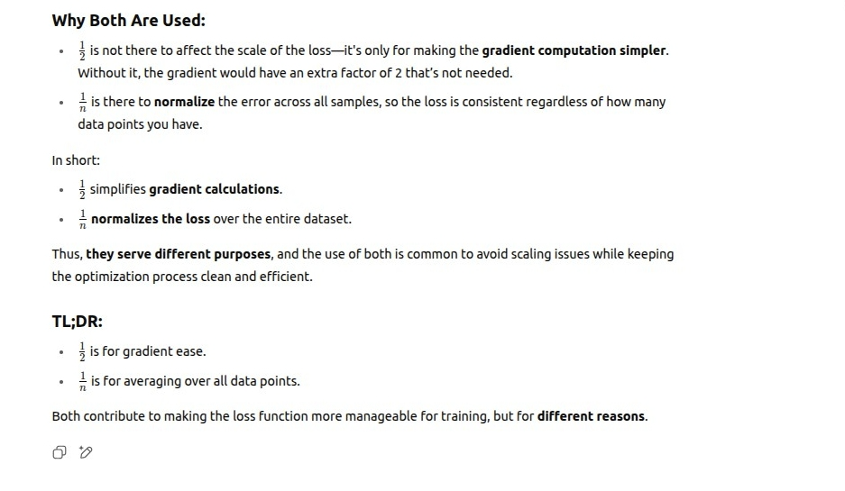

### How to constuct the tree in XGBoost 

- Step 1: Compute Gradients and Hessians

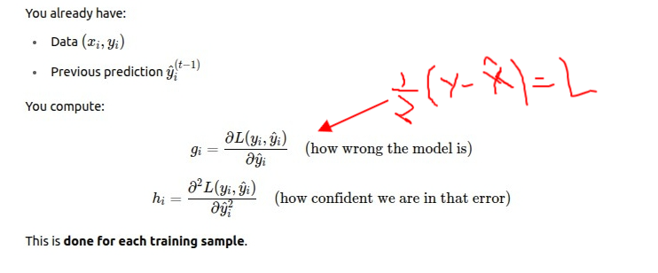

- Step 2: Start with One Root Node

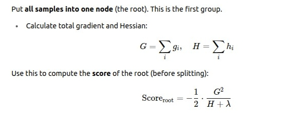

- Step 3: Try Splits on All Features

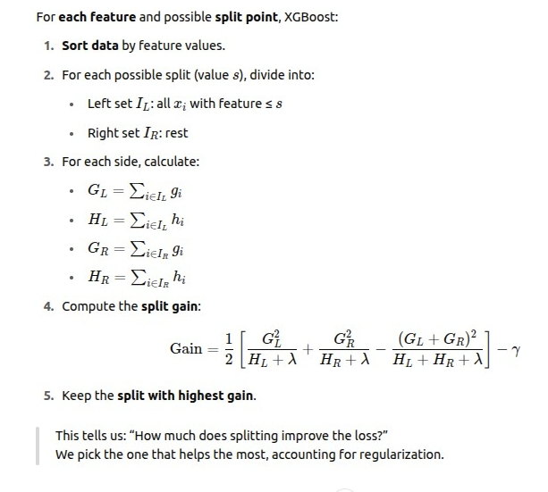

- Step 4: Recursively Split

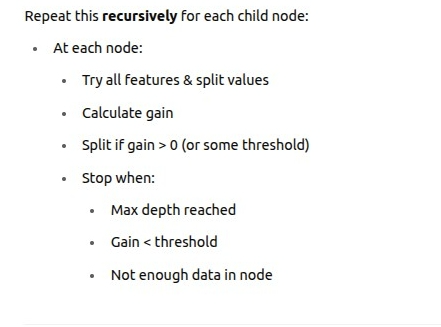

- Step 5: Compute Leaf Weights

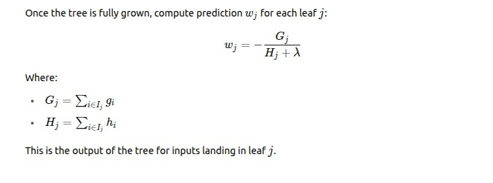

- Step 6: Update Predictions

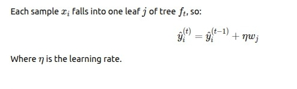